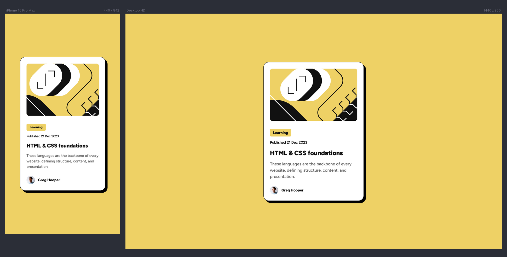

# Frontend Mentor - Blog preview card solution

This is a solution to the [Blog preview card challenge on Frontend Mentor](https://www.frontendmentor.io/challenges/blog-preview-card-ckPaj01IcS). Frontend Mentor challenges help you improve your
coding skills by building realistic projects.

## 💪 Challenge

Your challenge is to build out this blog preview card and get it looking as close to the design as possible.

Your users should be able to:

- See hover and focus states for all interactive elements on the page.

### 💡 Ideas to test yourself

- Focus on writing semantic HTML and using the correct elements based on the content.
- The font sizes in this project are slightly smaller in the mobile layout. Find a way to reduce font size for smaller screens without using media queries.

## 📸 Screenshots

## 🔗 Links

&nbsp;&nbsp;
&nbsp;&nbsp;

## 👷🏻‍♀️ Built with

- Semantic HTML
- [New Reset CSS](https://elad2412.github.io/the-new-css-reset)
- [CSS Clamp](https://clamp.vittoretrivi.dev)
- CSS Variables
- Flexbox
- Media Queries

## 👩🏻‍💻 Author

&nbsp;&nbsp;
&nbsp;&nbsp;

