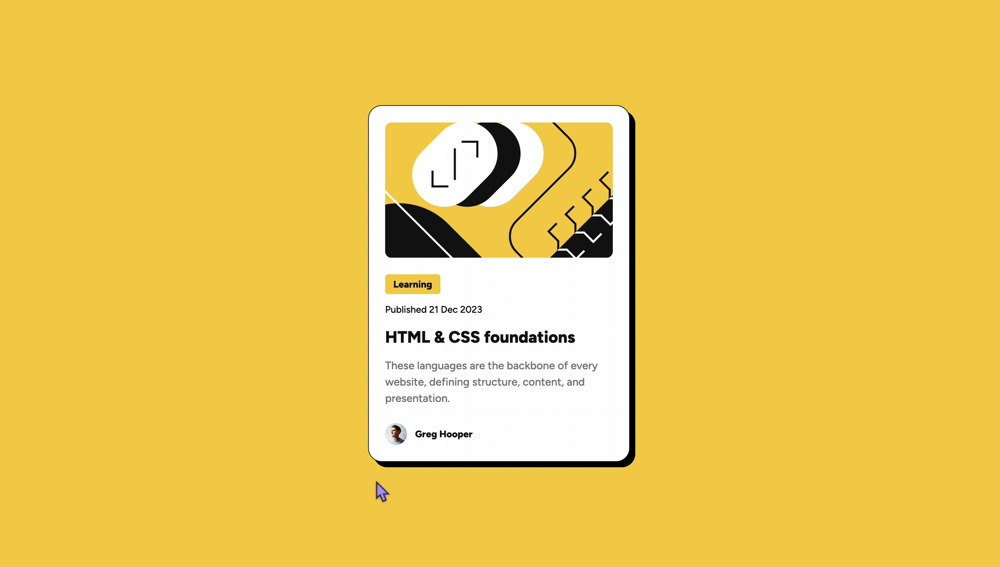
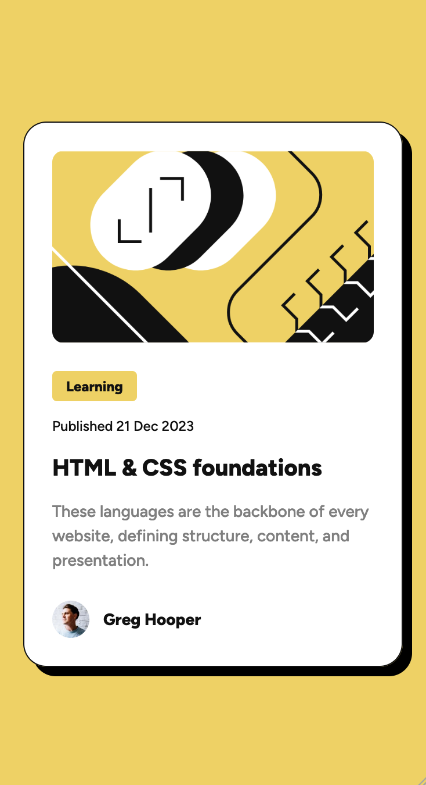

# Blog Preview Card

This is a solution to the [Blog Preview Card](https://www.frontendmentor.io/challenges/blog-preview-card-ckPaj01IcS)
challenge on [Frontend Mentor](https://www.frontendmentor.io)

## 💪 Challenge

Create a Blog Preview Card and style it according to the provided design specifications.
The component should be visually appealing and fully responsive, ensuring optimal functionality
across different devices and screen sizes. Additionally, you need to implement **hover** and
**focus** states for all interactive elements on the card.

## 📸 Screenshots

### 🖥️ Desktop

### 📱 Mobile

## 🔗 Links

&nbsp;&nbsp;

&nbsp;&nbsp;

## 🛠️ Built with

- Semantic HTML
- CSS Variables
- Flexbox
- `reset.css`
- CSS `clamp()`
- CSS Transitions

## 👩🏻‍🎓 What I learned

<dl>
  <dt>CSS <code>clamp()</code></dt>
  <dd>
    clamps a middle value within a range of values between a defined minimum
    bound and a maximum bound.
  </dd>
</dl>

## 👍🏻 Useful resources

- Modern [reset.css](https://elad2412.github.io/the-new-css-reset/)
- [Clamp Calculator](https://utopia.fyi/clamp/calculator/)
- [Frontend Mentor](https://frontendmentor.io)

## 💻 Author

&nbsp;&nbsp;

&nbsp;&nbsp;

